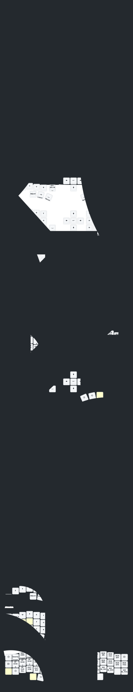

# Eyelash Corne ZMK

This is the ZMK configuration for my [Eyelash Corne](https://github.com/a741725193/zmk-new_corne) keyboard with [SuperMini MCU boards](https://github.com/joric/nrfmicro/wiki/Alternatives#supermini-nrf52840) and nice!view compatible displays.

The keymap implements my [Colemax-Maxtend](https://github.com/mhantsch/maxtend) configuration.

This config supports [ZMK Studio](https://github.com/zmkfirmware/zmk-studio).

## About the 睫毛外设 (Eyelash Peripherals) Corne keyboard ZMK 

Forked from [Eyelash Corne](https://github.com/a741725193/zmk-new_corne).

**This keyboard is not the same as [foostan's Corne](https://github.com/foostan/crkbd). It will not work with standard `corne` firmware.**

## Keymap Diagram

